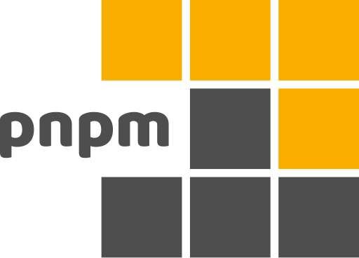

### 👋 &nbsp;Hi there, I'm Chris

- 🧑🏻‍💻 Front-end Engineer
- [@UnoCSS](https://github.com/unocss) team member
- [@Onu-UI](https://github.com/onu-ui) creator
- [@elk-zone](https://github.com/elk-zone) farm member
- [@vuejs](https://github.com/vuejs/core)、[@nuxt](https://github.com/nuxt/nuxt)、[@vite](https://github.com/vitejs/vite) etc. ecological contributors

#### ☎️ Find me

- ✉️ [Email](mailto:zyyz2@qq.com)
- [Twitter](https://twitter.com/chris_zyyv)
- 📖 [Personal Website](http://zyob.top)

#### 🛠 Tech Stack

<code>
  
</code>
<code>
  
</code>
<code>
  
</code>
<code>
  
</code>
<code>
  
</code>
<code>
  
</code>
<code>
  
</code>
<code>
  
</code>
<code>
  
</code>
<code>
  
</code>

#### ⚙️ Projects

📦 &nbsp;Packages

##### Maintaining
- [unocss/unocss](https://github/unocss/unocss) - The instant on-demand atomic CSS engine.
- [onu-ui/onu-ui](https://github/onu-ui/onu-ui) - Popular, beautiful and fast UnoCSS component library.

##### Personal
- [unocss-animates](https://github.com/zyyv/unocss-animates) - Preview all animations in UnoCSS.
- [unocss-preset-useful](https://github.com/zyyv/unocss-preset-useful) - My useful preset about unocss usage.
- [unplugin-vue-image](https://github.com/zyyv/unplugin-vue-image) - 自动引入图片。Auto import images.
- [unplugin-unocss-config](https://github.com/zyyv/unplugin-unocss-config) - Use uno config in runtime.
- [unplugin-vue-dotenv](https://github.com/zyyv/unplugin-vue-dotenv) - Auto generate the corresponding `.env` file.
- [vite-plugin-copyfile](https://github.com/zyyv/vite-plugin-copyfile) - Copy some files to your aim path when build end.

<!-- ## 🍁 &nbsp;My Stats

  
  

-->
